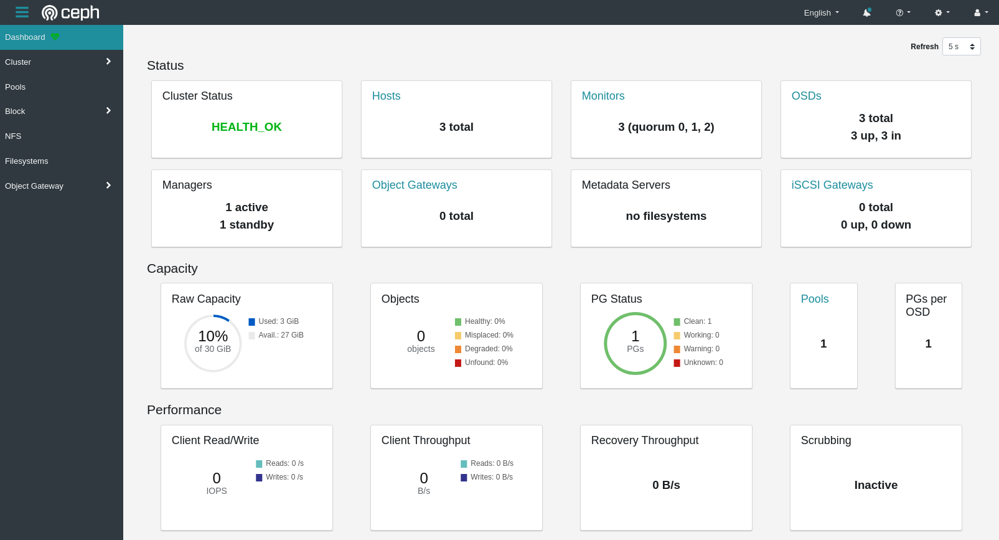
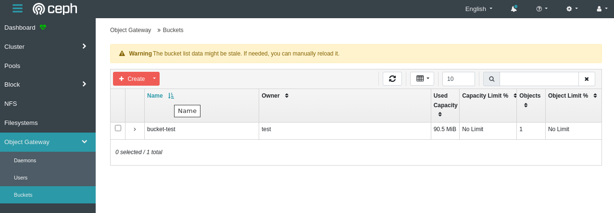

# Ceph Cluster

## Preparation

Prepare the follwoing 3 nodes with vagrant.

| host | ip address |
| ------ | ------ |
|   node1     |    192.168.11.31    |
|   node2     |    192.168.11.32    |
|   node3     |    192.168.11.33    |

Set `VAGRANT_EXPERIMENTAL=disks` to allow Vagrant to manage and configure virtual hard disks for certain providers and start and provision the vagrant environment.

```
VAGRANT_EXPERIMENTAL=disks vagrant up
```

Confirm 3 nodes with the following command.

```
$ vagrant status
Current machine states:

node1                     running (virtualbox)
node2                     running (virtualbox)
node3                     running (virtualbox)
```

## Build Ceph cluster

### Bootstrap cluster

SSH into `node1`.

```
vagrant ssh node1
```

Install `cephadm` package and `ceph-common` package using `cephadm` so that ceph commands can be run.

```
sudo apt install -y cephadm
sudo cephadm install ceph-common
```

Boostrap a cluster.

```
sudo cephadm bootstrap --mon-ip 192.168.11.31 --ssh-user vagrant
```

<details><summary>output</summary>

```
Verifying podman|docker is present...
Verifying lvm2 is present...
Verifying time synchronization is in place...
Unit systemd-timesyncd.service is enabled and running
Repeating the final host check...
podman|docker (/usr/bin/docker) is present
systemctl is present
lvcreate is present
Unit systemd-timesyncd.service is enabled and running
Host looks OK
Cluster fsid: fcd9dd08-4577-11ee-a1d5-455a67f2ca6f
Verifying IP 192.168.11.31 port 3300 ...
Verifying IP 192.168.11.31 port 6789 ...
Mon IP 192.168.11.31 is in CIDR network 192.168.11.0/24
Pulling container image quay.io/ceph/ceph:v15...
Extracting ceph user uid/gid from container image...
Creating initial keys...
Creating initial monmap...
Creating mon...
Waiting for mon to start...
Waiting for mon...
mon is available
Assimilating anything we can from ceph.conf...
Generating new minimal ceph.conf...
Restarting the monitor...
Setting mon public_network...
Creating mgr...
Verifying port 9283 ...
Wrote keyring to /etc/ceph/ceph.client.admin.keyring
Wrote config to /etc/ceph/ceph.conf
Waiting for mgr to start...
Waiting for mgr...
mgr not available, waiting (1/10)...
mgr not available, waiting (2/10)...
mgr not available, waiting (3/10)...
mgr is available
Enabling cephadm module...
Waiting for the mgr to restart...
Waiting for Mgr epoch 4...
Mgr epoch 4 is available
Setting orchestrator backend to cephadm...
Generating ssh key...
Wrote public SSH key to to /etc/ceph/ceph.pub
Adding key to vagrant@localhost's authorized_keys...
Adding host node1...
Deploying mon service with default placement...
Deploying mgr service with default placement...
Deploying crash service with default placement...
Enabling mgr prometheus module...
Deploying prometheus service with default placement...
Deploying grafana service with default placement...
Deploying node-exporter service with default placement...
Deploying alertmanager service with default placement...
Enabling the dashboard module...
Waiting for the mgr to restart...
Waiting for Mgr epoch 11...
Mgr epoch 11 is available
Generating a dashboard self-signed certificate...
Creating initial admin user...
Fetching dashboard port number...
Ceph Dashboard is now available at:

             URL: https://node1:8443/
            User: admin
        Password: ca638hd4bq

You can access the Ceph CLI with:

        sudo /usr/sbin/cephadm shell --fsid fcd9dd08-4577-11ee-a1d5-455a67f2ca6f -c /etc/ceph/ceph.conf -k /etc/ceph/ceph.client.admin.keyring

Please consider enabling telemetry to help improve Ceph:

        ceph telemetry on

For more information see:

        https://docs.ceph.com/docs/master/mgr/telemetry/

Bootstrap complete.
```

</details>

<br>

For more information about it, see the [DOC: RUNNING THE BOOTSTRAP COMMAND](https://docs.ceph.com/en/latest/cephadm/install/#running-the-bootstrap-command)

The `--ssh-user <user>` option makes it possible to choose which SSH user cephadm will use to connect to hosts. The associated SSH key will be added to `/home/<user>/.ssh/authorized_keys`. The user that you designate with this option must have passwordless sudo access.

You can confirm the cluster by the following command.

```
$ sudo ceph -s
  cluster:
    id:     fcd9dd08-4577-11ee-a1d5-455a67f2ca6f
    health: HEALTH_WARN
            OSD count 0 < osd_pool_default_size 3
 
  services:
    mon: 1 daemons, quorum node1 (age 5m)
    mgr: node1.hjvlku(active, since 4m)
    osd: 0 osds: 0 up, 0 in
 
  data:
    pools:   0 pools, 0 pgs
    objects: 0 objects, 0 B
    usage:   0 B used, 0 B / 0 B avail
    pgs:    
```

Access the dashboard through `https://node1:8443/`.

### Add new hosts to cluster

Start an SSH Agent for the current shell.  
(*SSH Agent holds SSH keys decrypted in memory until removed or the process is killed)

```
eval $(ssh-agent)
```

Add a specific key to the ssh-agent.

```
ssh-add /vagrant/.vagrant/machines/node2/virtualbox/private_key
ssh-add /vagrant/.vagrant/machines/node3/virtualbox/private_key
```

> This is slightly off-topic but Vagrant by default creates a passwordless sudo and passwordless SSH access to the virtual machines in creates, the SSH access is possible through private key which it creates and puts in `.vagrant/machines/*<machine name>*/virtualbox/private_key` in the host Vagrantfile directory. Vagrant also maps Vagrantfile directory to `/vagrant` in the guest virtual machine

```
$ ssh-add -l
2048 SHA256:F7+YSfFcUPYqBj9wPmwtOjE7tYLP7uvbh7HHKbL6Ilk /vagrant/.vagrant/machines/node2/virtualbox/private_key (RSA)
2048 SHA256:NN3Wa3jRLtW6/7Nr8LgY1xWUP541zJUlaDU6OfpQ95E /vagrant/.vagrant/machines/node3/virtualbox/private_key (RSA)
```

Copy Ceph public keys to authorized_keys in the other virtual machines to make Ceph able to access those machines.

```
ssh-copy-id -f -i /etc/ceph/ceph.pub vagrant@node2
ssh-copy-id -f -i /etc/ceph/ceph.pub vagrant@node3
```

Add the new hosts to the cluster.

```
sudo ceph orch host add node2 192.168.11.32
sudo ceph orch host add node3 192.168.11.33
```

Confirm the cluster status.

```
$ sudo ceph status
  cluster:
    id:     fcd9dd08-4577-11ee-a1d5-455a67f2ca6f
    health: HEALTH_WARN
            OSD count 0 < osd_pool_default_size 3
 
  services:
    mon: 3 daemons, quorum node1,node3,node2 (age 75s)
    mgr: node1.hjvlku(active, since 26m), standbys: node2.ykciww
    osd: 0 osds: 0 up, 0 in
 
  data:
    pools:   0 pools, 0 pgs
    objects: 0 objects, 0 B
    usage:   0 B used, 0 B / 0 B avail
    pgs: 
```

### Use devices as OSDs

Check the available devices which can be deployed on OSDs.

```
$ sudo ceph orch device ls 
Hostname  Path      Type  Serial  Size   Health   Ident  Fault  Available  
node1     /dev/sdc  hdd           10.7G  Unknown  N/A    N/A    Yes        
node1     /dev/sdb  hdd           10.4M  Unknown  N/A    N/A    No         
node2     /dev/sdc  hdd           10.7G  Unknown  N/A    N/A    Yes        
node2     /dev/sdb  hdd           10.4M  Unknown  N/A    N/A    No         
node3     /dev/sdc  hdd           10.7G  Unknown  N/A    N/A    Yes        
node3     /dev/sdb  hdd           10.4M  Unknown  N/A    N/A    No  
```

Add devices as OSDs.

```
sudo ceph orch daemon add osd node1:/dev/sdc
sudo ceph orch daemon add osd node2:/dev/sdc
sudo ceph orch daemon add osd node3:/dev/sdc
```

Confirm the cluster status.

```
$ sudo ceph status
  cluster:
    id:     fcd9dd08-4577-11ee-a1d5-455a67f2ca6f
    health: HEALTH_OK
 
  services:
    mon: 3 daemons, quorum node1,node3,node2 (age 13m)
    mgr: node1.hjvlku(active, since 37m), standbys: node2.ykciww
    osd: 3 osds: 3 up (since 109s), 3 in (since 109s)
 
  data:
    pools:   1 pools, 1 pgs
    objects: 0 objects, 0 B
    usage:   3.0 GiB used, 27 GiB / 30 GiB avail
    pgs:     1 active+clean
```

Access the dashboard through `https://node1:8443/`.

<div align="center">

</div>

### Deploying the Ceph Object Gateway

Ceph Object Gateway (RADOS Gateway,RGW) is an object storage interface and  provides a RESTful gateway between applications and Ceph Storage Clusters.

For more information about it, see the [DOC: CEPH OBJECT GATEWAY](https://docs.ceph.com/en/latest/radosgw/#ceph-object-gateway).

Create realm, zone group, zone.

```
sudo radosgw-admin realm create --rgw-realm=default --default
sudo radosgw-admin zonegroup create --rgw-zonegroup=default --master --default
sudo radosgw-admin zone create --rgw-zonegroup=default --rgw-zone=us-east-1 --master --default
```

Deploy Ceph Object Gateway daemon.

```
sudo ceph orch apply rgw default us-east-1 --placement="1 node1"
```

Confirm the cluster status.

```
$ sudo ceph status
  cluster:
    id:     fcd9dd08-4577-11ee-a1d5-455a67f2ca6f
    health: HEALTH_OK
 
  services:
    mon: 3 daemons, quorum node1,node3,node2 (age 48m)
    mgr: node1.hjvlku(active, since 72m), standbys: node2.ykciww
    osd: 3 osds: 3 up (since 36m), 3 in (since 36m)
    rgw: 1 daemon active (test.test_realm.test_zone.node1.qdgpcm)
```

Create RGW user.

```
sudo radosgw-admin user create --uid=test --display-name=test --access-key=test --secret-key=test
```

## Using AWS CLI for Accessing Ceph Object Storage

Install awscli

```
sudo apt install awscli -y
```

Configuration

```
$ aws configure --profile=default
AWS Access Key ID [None]: test
AWS Secret Access Key [None]: test
Default region name [None]: us-east-1
Default output format [None]: json
```

Make bucket

```
aws s3 mb s3://bucket-test --endpoint-url http://node1
```

Upload data

```
aws s3 cp prometheus-2.46.0.linux-amd64.tar.gz s3://bucket-test --endpoint-url http://node1
```

Create  user in order to access the object gateway service whether it was from an API or from Ceph dashboard.

```
sudo radosgw-admin user create --uid="sys" --display-name="sys" --access-key="sys" --secret-key="sys" --system
echo -n "sys" > /tmp/access_key
echo -n "sys" > /tmp/secret_key
sudo ceph dashboard set-rgw-api-access-key -i /tmp/access_key 
sudo ceph dashboard set-rgw-api-secret-key -i /tmp/secret_key
```

<div align="center">

</div>

## _Referernces_

* [Exploring Ceph in a multi-node setup](https://dev.to/akhal3d96/exploring-ceph-in-a-multi-node-setup-3c8h)
* [Deploy a Ceph cluster within minutes using Cephadm](https://shonpaz.medium.com/deploy-a-ceph-cluster-within-minutes-using-cephadm-53e3b915416f)
* [Chapter 10. Management of Ceph object gateway using the Ceph Orchestrator](https://access.redhat.com/documentation/en-us/red_hat_ceph_storage/5/html/operations_guide/management-of-ceph-object-gateway-services-using-the-ceph-orchestrator).

memo commands

* vboxmanage list vms
* vboxmanage unregistervm ceph-ansible_osd2_1692935468584_43585 --delete
* vagrant global-statuslobal-status